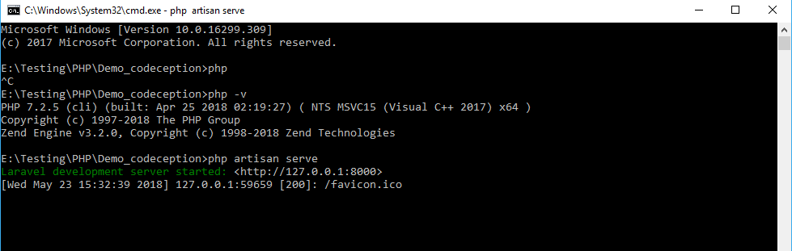
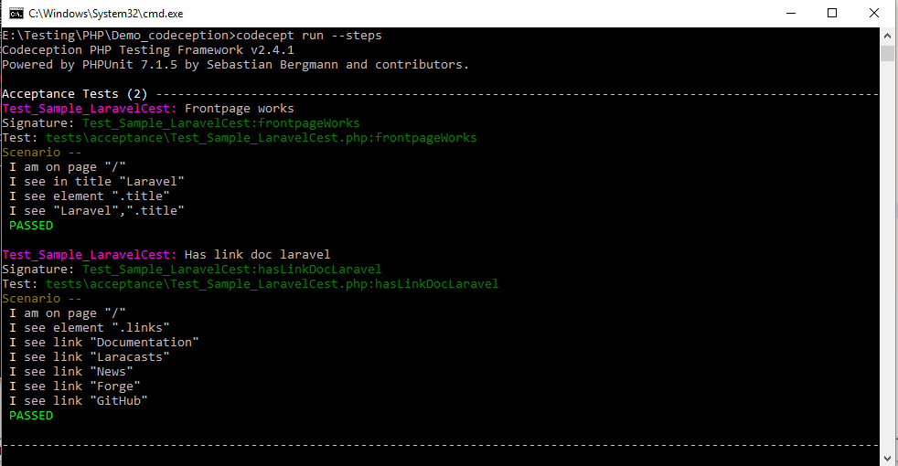

# codeception

# Installation
- git clone https://github.com/nguyenphutu/codeception/ projectname
- cd projectname
- composer install
- php artisan serve to start the app on http://localhost:8000/

- open new terminal, go to projectname path
- run codeception test: codecept run --steps
- Result 

